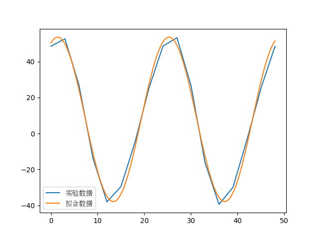
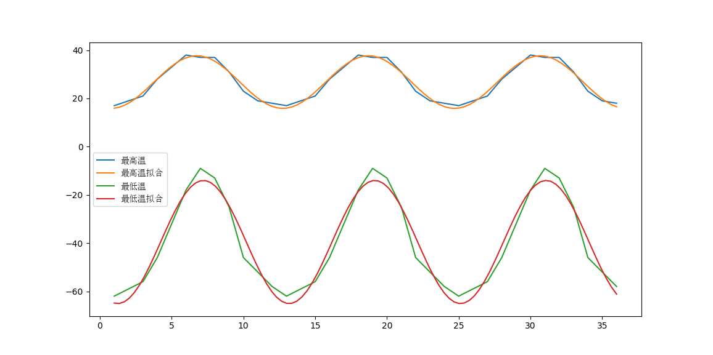

本周作业：  
1）大家课堂中没有完成的  
  
2） 温度数据的曲线拟合  
下面是从1月开始阿拉斯加每个月的温度极值（摄氏度）：  
最大值: 17, 19, 21, 28, 33, 38, 37, 37, 31, 23, 19, 18  
最小值: -62, -59, -56, -46, -32, -18, -9, -13, -25, -46, -52, -58  
绘制这些温度极值。  
定义一个函数，可以描述温度的最大值和最小值。提示：这个函数的周期是一年。提示：包含时间偏移。  
用scipy.optimize.curve_fit()拟合这个函数与数据。  
绘制结果。这个拟合合理吗？如果不合理，为什么？  
  
最高温的拟合结果比较贴近，但最低温的拟合偏离较大，这是因为最低温的上升、下降速率过快，不符合正弦函数  
  
最低温度和最高温度的时间偏移是否与拟合一样精确？  
  
